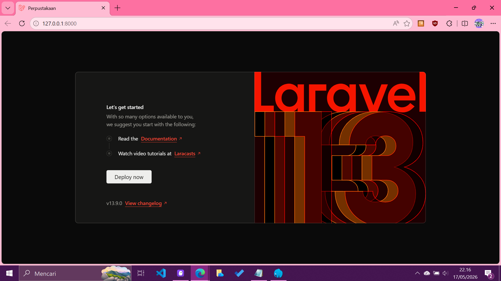
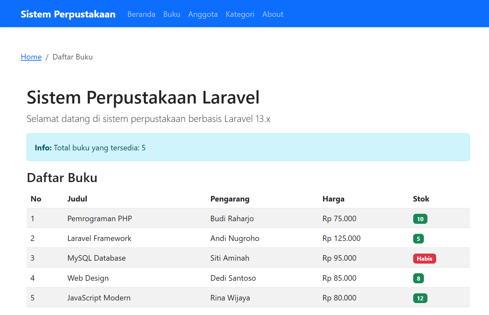
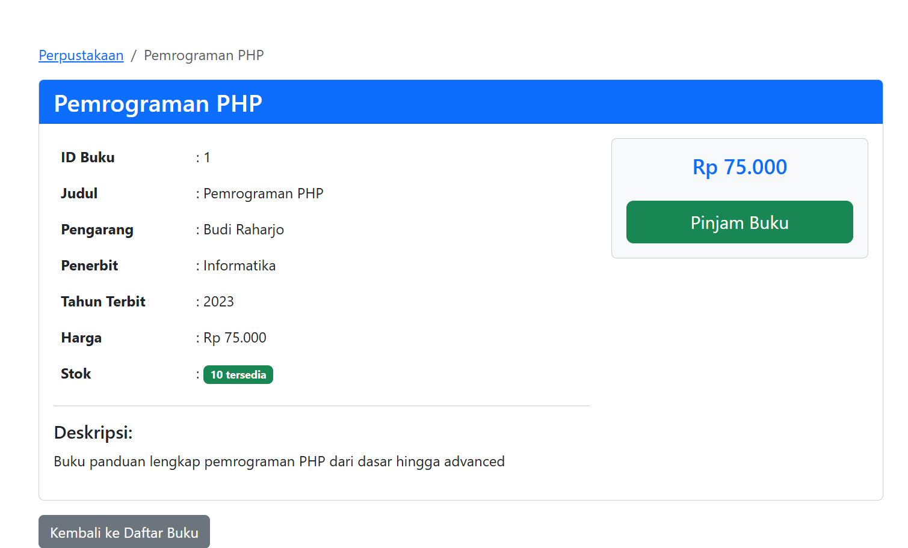
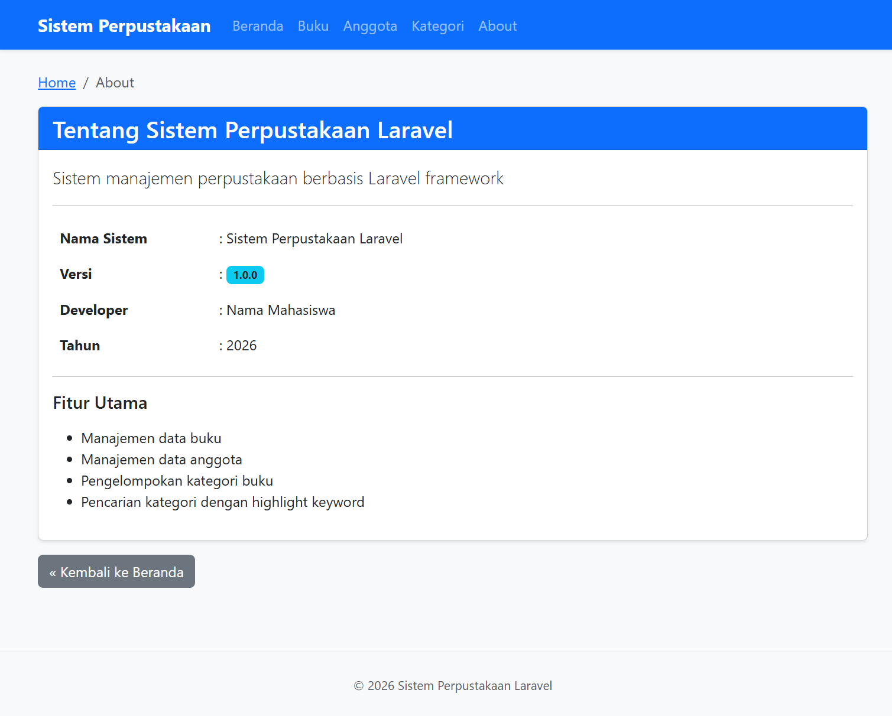
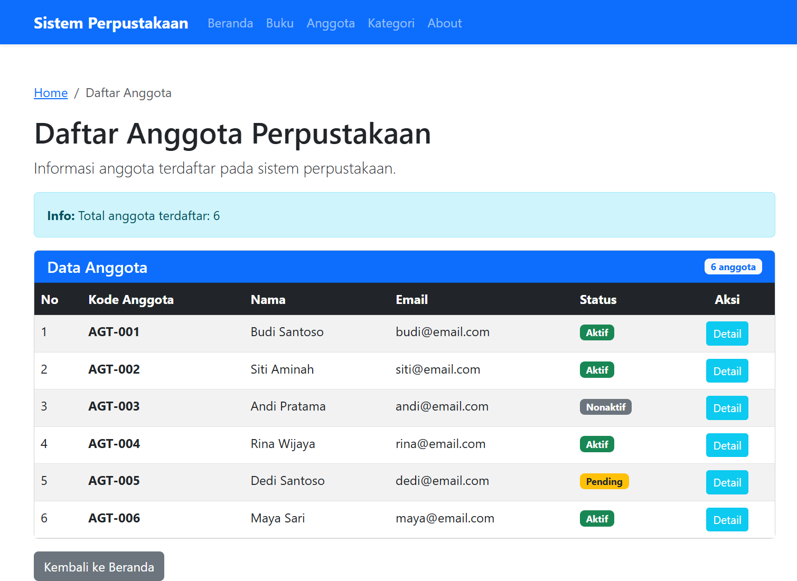
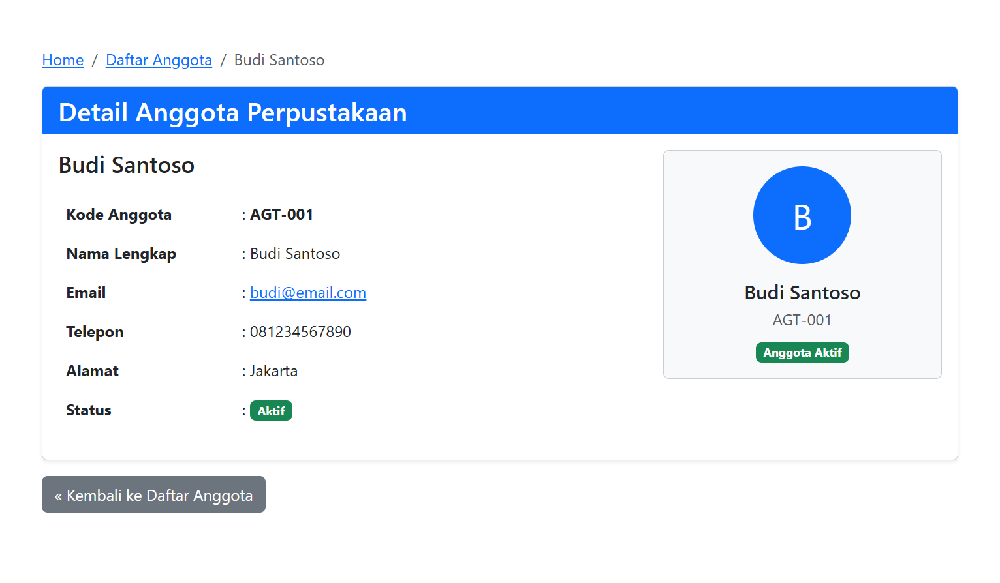
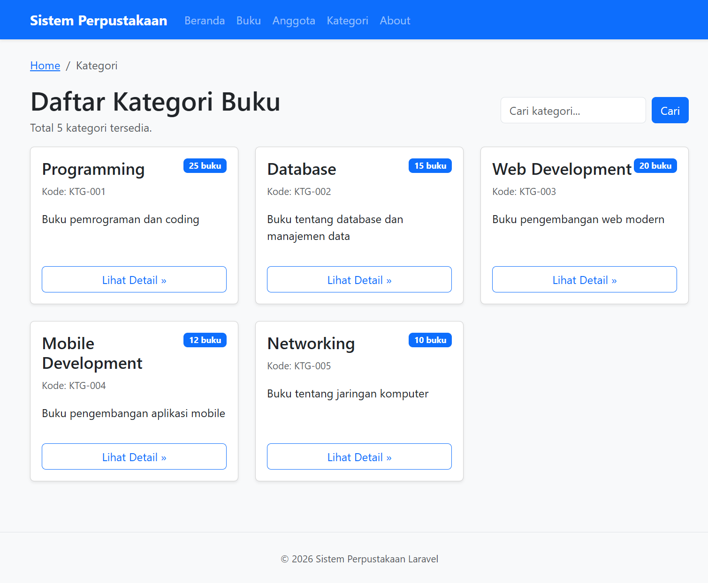
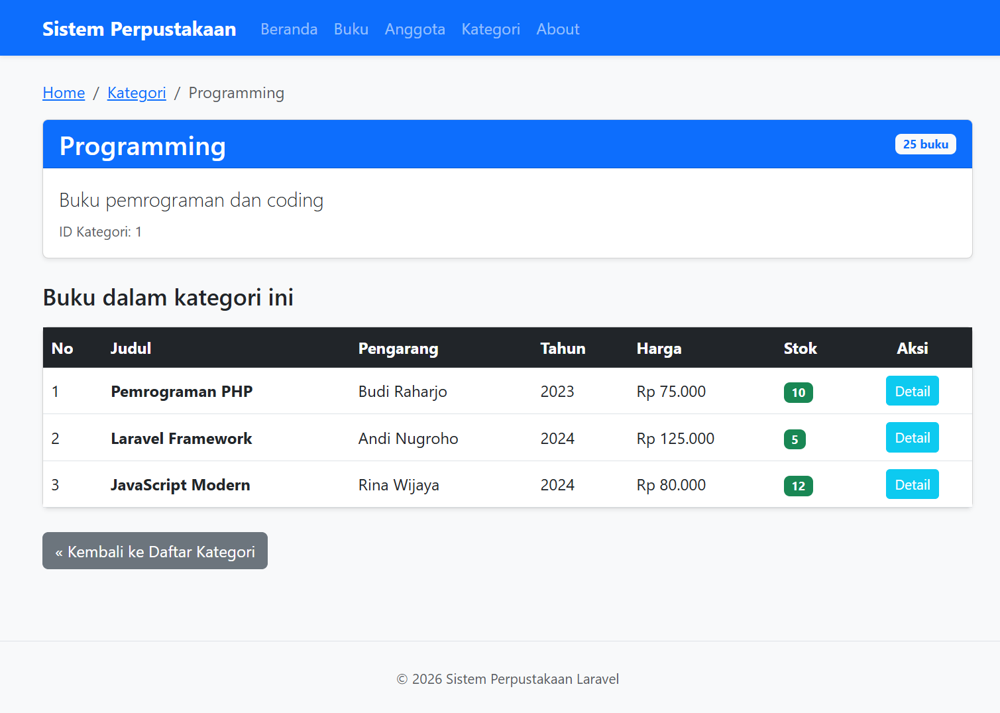
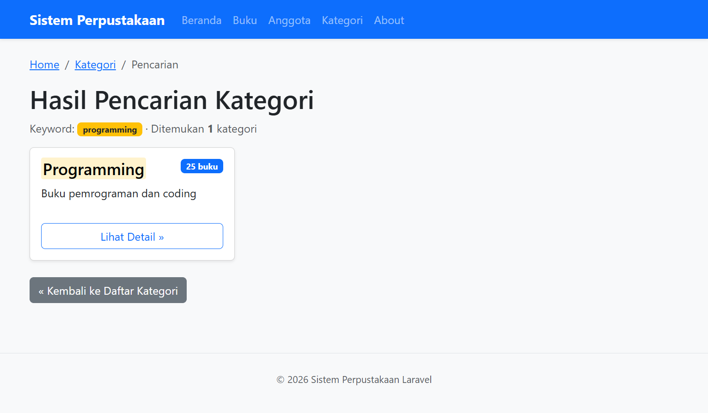

# Pengenalan Framework Laravel & MVC

> Tugas Pertemuan 9 — Routing, Controller dan View dengan Laravel Framework

---

## Daftar Route

| Method | URL | Controller / Action | Keterangan |
|--------|-----|---------------------|------------|
| GET | `/` | Closure | Halaman welcome |
| GET | `/perpustakaan` | `PerpustakaanController@index` | Daftar buku |
| GET | `/buku/{id}` | `PerpustakaanController@show` | Detail buku |
| GET | `/about` | `PerpustakaanController@about` | Halaman about |
| GET | `/anggota` | Closure | Daftar anggota |
| GET | `/anggota/{id}` | Closure | Detail anggota |
| GET | `/kategori` | `KategoriController@index` | Daftar kategori |
| GET | `/kategori/{id}` | `KategoriController@show` | Detail kategori |
| GET | `/kategori/search/{keyword}` | `KategoriController@search` | Cari kategori |

---

## Screenshot Hasil

### 1. Halaman Home
> Source: [`resources/views/welcome.blade.php`](resources/views/welcome.blade.php)

---

### 2. Daftar Buku (`/perpustakaan`)
> Source: [`resources/views/perpustakaan/index.blade.php`](resources/views/perpustakaan/index.blade.php) 
> Controller: [`app/Http/Controllers/PerpustakaanController.php`](app/Http/Controllers/PerpustakaanController.php)

---

### 3. Detail Buku (`/buku/1`)
> Source: [`resources/views/perpustakaan/show.blade.php`](resources/views/perpustakaan/show.blade.php) 
> Controller: [`app/Http/Controllers/PerpustakaanController.php`](app/Http/Controllers/PerpustakaanController.php)

---

### 4. Halaman About (`/about`)
> Source: [`resources/views/perpustakaan/about.blade.php`](resources/views/perpustakaan/about.blade.php)  
> Controller: [`app/Http/Controllers/PerpustakaanController.php`](app/Http/Controllers/PerpustakaanController.php)

---

### 5. Daftar Anggota (`/anggota`)
> Source: [`resources/views/anggota/index.blade.php`](resources/views/anggota/index.blade.php)  
> Route: [`routes/web.php`](routes/web.php)

---

### 6. Detail Anggota (`/anggota/1`)
> Source: [`resources/views/anggota/show.blade.php`](resources/views/anggota/show.blade.php)  
> Route: [`routes/web.php`](routes/web.php)

---

### 7. Daftar Kategori (`/kategori`)
> Source: [`resources/views/kategori/index.blade.php`](resources/views/kategori/index.blade.php)  
> Controller: [`app/Http/Controllers/KategoriController.php`](app/Http/Controllers/KategoriController.php)

---

### 8. Detail Kategori (`/kategori/1`)
> Source: [`resources/views/kategori/show.blade.php`](resources/views/kategori/show.blade.php)  
> Controller: [`app/Http/Controllers/KategoriController.php`](app/Http/Controllers/KategoriController.php)

---

### 9. Pencarian Kategori (`/kategori/search/programming`)
> Source: [`resources/views/kategori/search.blade.php`](resources/views/kategori/search.blade.php)  
> Controller: [`app/Http/Controllers/KategoriController.php`](app/Http/Controllers/KategoriController.php)

